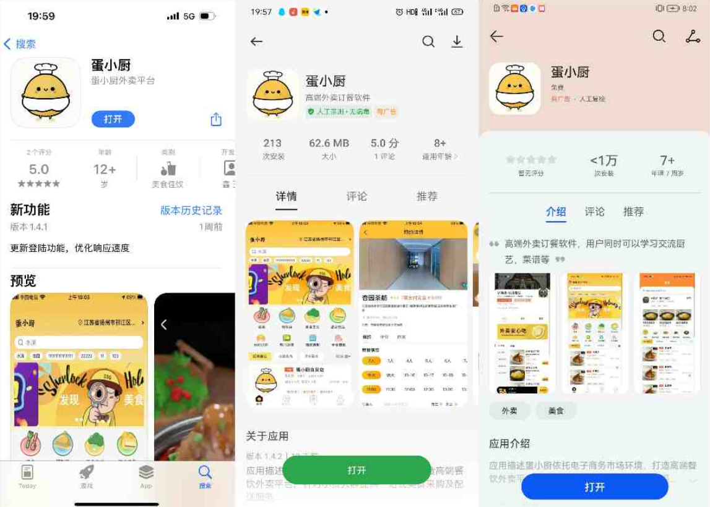
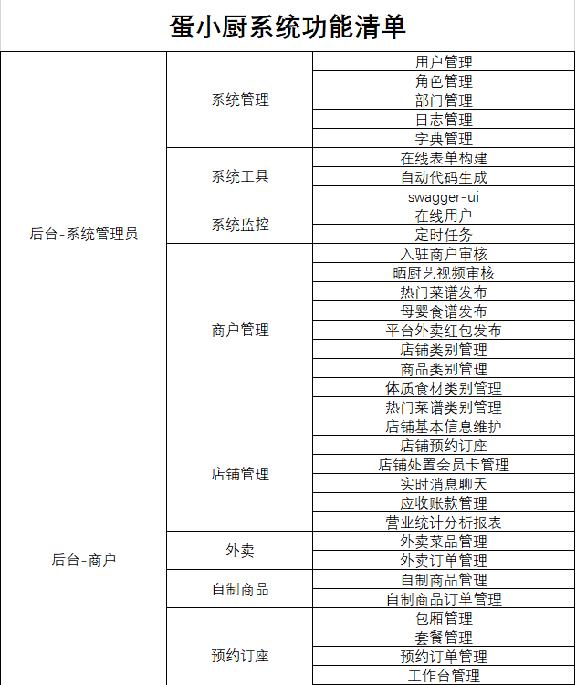
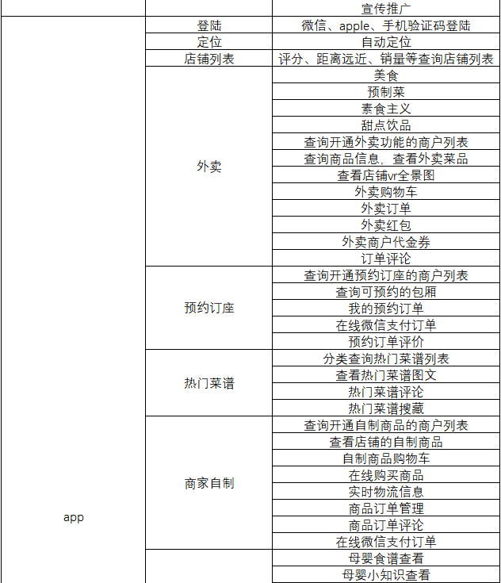
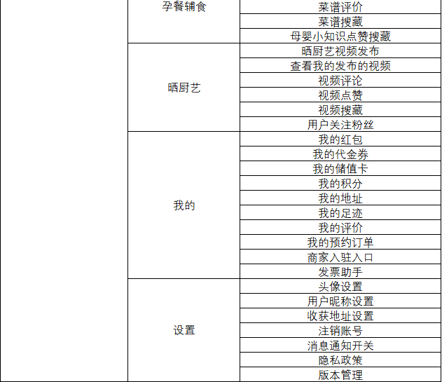
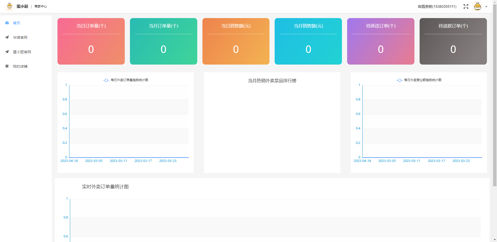
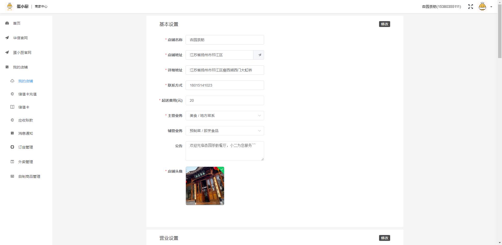
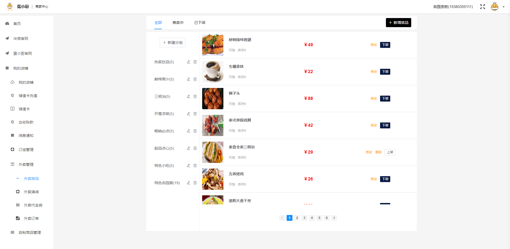
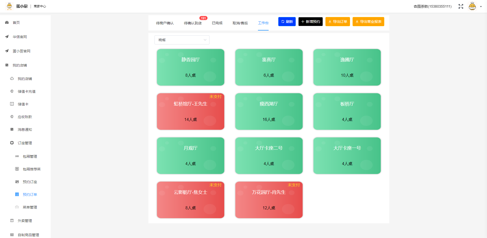
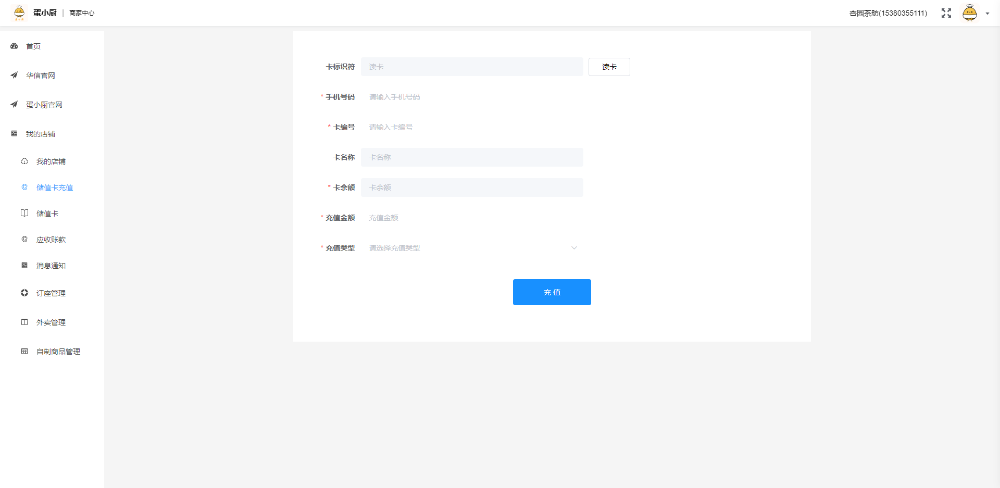

# 蛋小厨app 中高端外卖餐饮平台

# 版权所有
江苏永信信息技术有限公司 

# 官网
http://www.huasense.tech/

# 平台简介
蛋小厨app包括商家管理端，和客户端app两个端。其中app端登陆功能包括手机验证码登陆、第三方微信、apple登陆等；包括在线预定包厢、在线点餐外卖、在线厨艺交流、热门菜谱浏览、孕餐辅食学习、在线商场购买商品等功能，用户可以通过app注册成为商家，需要提供必要的证件资料通过平台审核可以在app中商家商品菜品等。商家后台管理端可以注册申请开店、新增店铺信息、可以编辑商品、菜品信息等。同时后台管理端集成下票打印机、rfid会员卡、语音播报提醒功能等。

# 终端介绍

app体验：各手机应用市场搜索蛋小厨体验或者百度手机助手搜索蛋小厨体验

商家管理端体验：http://localhost:80

# 软件架构

 **后台：** 

1. springboot 
2. nacos 管理微服务、配置中心、负载中心、限流
3. seata 事务管理 跨服务之间事务管理
4. gateway 网关服务服务分发
5. job 定时任务服务
6. system 系统服务，用户管理、角色管理等

 **前台：** 

1. hbuilder 
2. vue

# 功能清单

# app截图

**app外卖点餐功能，首页可以根据点位查看我附件5km以内的外卖商家，用户可以查看商家外卖商品，商品加入购物车，支持在线微信支付以及查看我的外卖订单等。

**app提供外卖分类查看功能，能帮助用户快速定位商家。包括素食主义、预制菜、甜点饮品、其他美食，并且可以根据更多分类精准查询外卖商家** 

 **预约订座功能，用户可以查询支持包厢预约的商家，可以在线预定商家的包厢，根据商家规则支付订金可以预留包厢。同时可以在线查看的预约订单，支持在线支付订单、订金金额退款等。** 

 **热门菜谱功能，平台定时上传更新热门菜谱，用户可以通过app查看菜谱，可以更具不同分类菜谱查看菜谱信息，在家可以学习制作各类精美菜品，并且可以在菜谱评论上传自己的成果，共同学习交流**

 **在线商城购买商品，用户可以查看支持商品交易的商户，可以查看店铺的所有商品，加入购物车购买等，支持在线微信支付，对接物流信息，实时查看商品物流。用户购买成功后可在我的订单中查看我的商品订单**

 **孕餐辅食功能，平台定时上传适合孕妇儿童食用的菜谱，用户可以通过app查看菜谱，以及孕妇儿童生活小知识**

 **晒厨艺功能是app提供的用户可以上传自己的做菜视频共全网交流学习，发出的视频可以挂商家连接等，用户浏览视频可以直接点击进入商家主页。用户可以查看我的发布视频，我的点赞视频，我的收藏视频等。**

# 商家管理端截图

 **商家管理端首页、展示的外卖、商品销售数据统计分析图表等** 

 **我的店铺详细页面，可以维护商家的店铺信息、包括名称、图像、营业信息等** 

 **外卖菜品维护，可以维护菜品名称、价格、图片、库存等信息** 

 **外卖订金券发布，商户可以通过平台管理端发布代金券满减活动，用户可以通过app领取活动代金券，提高店铺下单率** 

 **外卖订单，商户可以通过管理平台查看用户提交的外卖订单，可以根据不同状态查看外卖订单** 

 **商家自制功能，商户可以通过管理平台维护店铺的商品，包括商品价格，商品名称，商品图片等，用户可以通过app查看购买该商品** 

 **平台支持在线预约订座功能，商户可以通过系统维护店铺的包厢信息，包括包厢的名称、图片、消费价格等信息** 

 **商户可以通过平台维护店铺支持的套餐，包括套餐名称、价格、明细、套餐适用包厢等** 

 

 **预约订单管理、商户可以查看店铺的所有预约订单，并对订单进行不同操作，取消、支付、开票等** 

 **会员储值卡维护、支持rfid读卡，支持使用储值卡在线支付功能** 

# 安装教程

1.  hbuilder 直接导入 浏览器运行查看 （最好真机运行体验）
2.  后台代码需要联系我私发（13645251009、15152763704）注: 需要代码的朋友加我好友发送 star 点星截图
3.  后台需要先 安装 nocos 并启动
4.  在行安装 seata 服务 并启动
5.  导入后台代码并启动gateway、system、auth、file、kitchen等服务即可体验

# 技术交流

**qq交流群1-676752772 专人值班免费指导安装部署以及二次开发**

# 代码开源
app前端代码完全开源，后端代码   商家管理端 代码开源（需要的朋友可以联系我私发 13645251009、15152763704）
注: 需要代码的朋友加我好友发送 star 点星截图
 
# 证件资料
